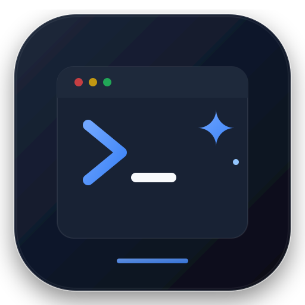

# 🚀 PromptDock — Windows 11 Desktop AI Prompt Manager

<div align="center">



**The ultra-fast, 100% offline, privacy-first AI Prompt Dock designed for Windows 11.**  
*Instant access to your elite AI prompts for ChatGPT, Claude, Gemini, Midjourney, Grok, and Copilots.*

[](https://fluent2.microsoft.design/)
[](https://www.pwabuilder.com/)
[](./privacy.html)
[](#tech-stack)
[](https://partner.microsoft.com/)
[](./LICENSE)

[**Live Web App**](https://hoquocanh261.github.io/PromptDock/) • [**Privacy Policy**](https://hoquocanh261.github.io/PromptDock/privacy.html) • [**Report Bug**](https://github.com/HoQuocAnh261/PromptDock/issues)

</div>

---

## ⚡ Overview

**PromptDock** is a lightweight, distraction-free desktop application built to streamline your AI workflows. Instead of manually editing messy notes or searching through browser bookmarks, PromptDock provides an instant floating dock on Windows 11 with **dynamic prompt variable forms**, **instant 1-click clipboard copying**, and **complete offline privacy**.

No cloud login, no monthly SaaS subscriptions, and zero tracking. Your intellectual property stays entirely on your local machine.

---

## ✨ Key Features

### 🧩 Dynamic Prompt Variables (Fill-in-the-Blanks Engine)
* **Smart Auto-Detection**: Automatically detects variable placeholders enclosed in square brackets `[PRODUCT NAME]`, `[TARGET AUDIENCE]`, or double curly brackets `{{variable}}`.
* **Interactive Fluent Form**: Renders dynamic, responsive text inputs right above the preview pane.
* **Real-time Live Substitution**: Watch your prompt update live as you type, with visual accent highlights.
* **1-Click Copy**: Press <kbd>Enter</kbd> or click the primary button to copy the personalized, ready-to-run prompt straight to your clipboard.

### 📚 36 Elite Production Prompts Pre-Loaded
Curated, high-ROI prompt templates across **13 high-demand categories**:
* **Software Engineering & Architecture**: Senior Code Review, Full-Stack REST API Generator, TypeScript/React Clean Architecture, SQL Performance & Deadlocks, Cybersecurity Pentesting, Async Python Scraping.
* **SEO & Digital Marketing**: Top 1 Google Pillar Content, Technical SEO Core Web Vitals, High-Converting SaaS Landing Page Hero, B2B Cold Email Sequence, Meta/FB Ad Angles.
* **AI Image & Generative Art**: Midjourney v6 Editorial Portraits, 3D Isometric Game Dioramas, DALL-E 3 Minimalist Vector Branding.
* **Startup & Business**: Y Combinator 10-Slide Pitch Deck, Unit Economics & LTV/CAC Sensitivity, Churn Prevention Playbook, Product Hunt Day 1 Kit.
* **Video & Creators**: 10-Minute High RPM YouTube Documentaries, Title/Thumbnail 30-concept Matrix, Viral 60s Shorts Storytelling.
* **Cognitive Reasoning**: ChatGPT Recursive Chain-of-Thought, Socratic Tutoring Engine, Gemini Deep Multimodal Synthesis.

### 🪟 Windows 11 Native Fluent Experience
* **Mica & Acrylic Glassmorphism**: Layered backdrop blur with adaptive dark and light modes.
* **Subtle Motion Physics**: 180ms cubic-bezier transitions matching the Windows 11 Shell guidelines.
* **High Accessibility**: Full keyboard focus rings, WCAG AAA contrast ratios, and screen-reader ARIA semantics.

### 🌐 Multilingual Internationalization (8 Languages)
* Instant UI localization with **English (Default)**, **Vietnamese (Tiếng Việt)**, **Japanese (日本語)**, **Korean (한국어)**, **Chinese (中文)**, **French (Français)**, **German (Deutsch)**, and **Spanish (Español)**.
* Switch on the fly via the top bar globe icon or Settings modal.

### 🔒 100% Offline & Zero-Telemetry Privacy
* Fully operable without an internet connection via our custom **Service Worker** caching engine.
* Zero external analytics, zero tracking cookies, zero remote telemetry calls.
* Full compliance with **Microsoft Store Certification Policy 10.5.1**.

### 💾 Data Sovereignty & Backup
* Local storage in HTML5 `localStorage`.
* 1-Click JSON export and import for seamless migration across multiple PCs.

---

## ⌨️ Keyboard Shortcuts Cheat Sheet

| Shortcut | Description |
| :--- | :--- |
| <kbd>Ctrl</kbd> + <kbd>Shift</kbd> + <kbd>Space</kbd> | Global hotkey to focus PromptDock search bar |
| <kbd>Ctrl</kbd> + <kbd>F</kbd> | Focus & select real-time search input |
| <kbd>Ctrl</kbd> + <kbd>N</kbd> | Open New Prompt creation modal |
| <kbd>Ctrl</kbd> + <kbd>S</kbd> | Save prompt while drafting in modal |
| <kbd>Enter</kbd> | Copy selected (or variable-filled) prompt to clipboard |
| <kbd>↑</kbd> / <kbd>↓</kbd> (Up/Down) | Seamlessly navigate through prompt list |
| <kbd>Delete</kbd> | Move currently highlighted prompt to Trash |
| <kbd>Esc</kbd> | Close active modal dialog or clear current search filter |

---

## 🛠️ Architecture & Tech Stack

```text
PromptDock Architecture
├── Presentation Layer : Pure Semantic HTML5 + Custom Fluent Design CSS3 Tokens
├── Application Logic  : Vanilla ES6 Modular Controller (Zero Frameworks, No React, No jQuery)
├── Local Storage      : Sandboxed Browser LocalStorage Engine with Schema Migration
├── Offline Engine     : Cache-First Progressive Web App Service Worker (PWA)
└── Windows Packaging  : MSIX Package Generation via Microsoft PWABuilder
```

PromptDock intentionally uses **zero external dependencies** (no npm runtime bloat, no CDNs) to guarantee instant cold boot times (< 50ms) and lifelong reliability.

---

## 🚀 Getting Started & Local Development

### Prerequisites
* Any modern web browser (Microsoft Edge, Google Chrome, Brave, Firefox).
* Optional: Node.js or Python for local preview server.

### Run Locally
```bash
# Clone repository
git clone https://github.com/HoQuocAnh261/PromptDock.git
cd PromptDock

# Serve with Python:
python -m http.server 8080

# Or serve with Node:
npx serve .
```

Open `http://localhost:8080` in **Microsoft Edge** or **Google Chrome**.

### Install as Windows Desktop App (PWA)
1. Click the **App Available** icon in the right side of the browser address bar (or menu `... ➔ Apps ➔ Install PromptDock`).
2. PromptDock will install as a standalone, borderless Windows 11 desktop app with its own taskbar pin and Start Menu shortcut.

---

## 📦 Packaging for Microsoft Store (MSIX)

PromptDock is engineered specifically for packaging into a native Windows `.msix` bundle using Microsoft's official **PWABuilder**:

1. Deploy the app to any HTTPS host (e.g. GitHub Pages or Vercel).
2. Go to [PWABuilder.com](https://www.pwabuilder.com/) and enter your HTTPS URL.
3. Verify your 100/100 PWA score across Manifest, Service Worker, and Security.
4. Click **Package for Windows** and download the signed `.msix` bundle.
5. Upload to your [Microsoft Partner Center](https://partner.microsoft.com/) dashboard to publish and distribute globally.

---

## 🛡️ Privacy & Security

PromptDock does not transmit, store, or share your creative prompts with any third party or remote server. All AI prompts, tags, variable values, and preferences are stored exclusively on your device.

Review our full [Privacy Policy](./privacy.html) for detailed certification compliance.

---

## 📄 License

This project is licensed under the **MIT License** — feel free to use, customize, and commercialize.

---

<div align="center">

Crafted with care for AI power users & creators worldwide.  
**If you find PromptDock helpful, please star ⭐ the repository!**

</div>
